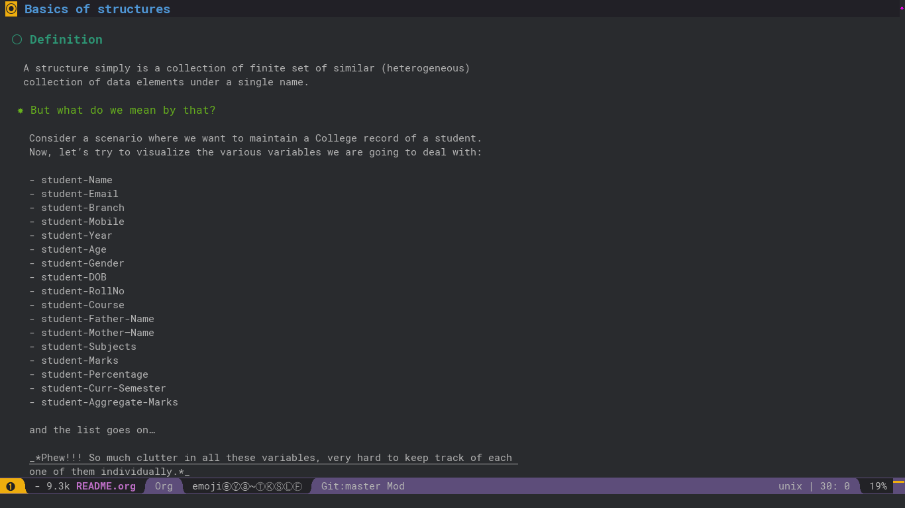

- [Basics of structures](#sec-1)
  - [Definition](#sec-1-1)
    - [But what do we mean by that?](#sec-1-1-1)
  - [Syntax](#sec-1-2)
  - [Properties of a structure](#sec-1-3)
  - [Structure variables](#sec-1-4)
- [A basic Students Record program](#sec-2)
  - [using standard approach](#sec-2-1)
  - [using structural approach](#sec-2-2)
  - [using structure with ’typedef’](#sec-2-3)
    - [Syntax:](#sec-2-3-1)
    - [Example:](#sec-2-3-2)
- [Thank You!](#sec-3)


# Basics of structures<a id="sec-1"></a>

## Definition<a id="sec-1-1"></a>

A structure simply is a collection of finite set of similar (heterogeneous) collection of data elements under a single name.

<div class="note">
This is a useful note.

</div>



### But what do we mean by that?<a id="sec-1-1-1"></a>

Consider a scenario where we want to maintain a College record of a student. Now, let’s try to visualize the various variables we are going to deal with:

-   student-Name
-   student-Email
-   student-Branch
-   student-Mobile
-   student-Year
-   student-Age
-   student-Gender
-   student-DOB
-   student-RollNo
-   student-Course
-   student-Father-Name
-   student-Mother–Name
-   student-Subjects
-   student-Marks
-   student-Percentage
-   student-Curr-Semester
-   student-Aggregate-Marks

and the list goes on…

<span class="underline">**Phew!!! So much clutter in all these variables, very hard to keep track of each one of them individually.**</span>

The best approach to follow in a programming environment is **“Divide n’Conquer”**. Instead of dealing with all these variables at once, let’s try to **divide them into groups**:

| <span class="underline">GROUP - A</span> | **student-Personal-Details** |
|                                          | - name                       |
|                                          | - age                        |
|                                          | - gender                     |
|                                          | - DOB                        |
|                                          | - email                      |
|                                          | - mobile                     |
|                                          | - father-Name                |
|                                          | - mother-name                |

| <span class="underline">GROUP - B</span> | **student-College-Details** |
|                                          | - rollNo                    |
|                                          | - year                      |
|                                          | - branch                    |
|                                          | - course                    |
|                                          | - semester                  |

| <span class="underline">GROUP - C</span> | **student-Academic-Details** |
|                                          | - subjects                   |
|                                          | - marks                      |
|                                          | - percentage                 |
|                                          | - aggregate                  |

Now it’s pretty easy to keep track of each of the variables with the help of their corresponding groups. Isn’t it? That’s exactly the idea behind the concepts of structure.

## Syntax<a id="sec-1-2"></a>

In C Language, The syntax of writing a block of structure is follows:

```C
struct <structure_name> {
  data_element#1;
  data_element#2;
  data_element#3;
    .
    .
    .
  data_element#n;
};
```

Now, Let’s try to construct our very own structure in C Language for the following sample:

| <span class="underline">GROUP - A</span> | **student-Personal-Details** |
|                                          | - name                       |
|                                          | - age                        |
|                                          | - gender                     |
|                                          | - DOB                        |
|                                          | - email                      |
|                                          | - mobile                     |
|                                          | - father-Name                |
|                                          | - mother-name                |

becomes:

```C
struct student_Personal_Details {
  char *name;
  int age;
  char gender;
  int DOB;
  char *email;
  int mobile;
  char father_Name;
  char mother_Name;
};
```

## Properties of a structure<a id="sec-1-3"></a>

-   Structure in itself is user-defined data-type.
-   The `<structure_name>` is a pointer, pointing the first data-element of it’s collection.
-   All the data-elements of a structure are stored in a contiguous memory fashion i.e in above example, if `student_Personal_Details` is a structure name then it would point/store the address of it’s first element: `char *name;`. We’ll later explore how it works internally.
-   A structure can hold as many data-elements as required and that too heterogeneous elements (different data-type).
-   Structures are defined globally.
-   All data-elements of a structure are private/only known to structure and it’s variables. They can’t be directly accessed outside the structure.
-   The data-elements in a structure are called `members` of that structure.
-   Structures and it’s members are accessed via their `structure variables` and the `DOT (.)` operator i.e.

## Structure variables<a id="sec-1-4"></a>

As we discussed earlier, `structure` itself is a user-defined data-type. So, every data-type must’ve a variable-name so as to use it. In case of `structures`, they are declared as follows:

```C
struct <structure_name> <structure_variable>; 
```

For example:

```C
struct student_Personal_Details std1;
```

So, `std1` is a variable name of `struct student_Personal_Details` data-type.

# A basic Students Record program<a id="sec-2"></a>

Now, Let’s try to develop a program where our goal is to get the following data of a student from the user:

-   Roll No
-   Name
-   Email
-   Branch

## using standard approach<a id="sec-2-1"></a>

Writing ’Students Record’ program using only single main/normal function.

```C
#include <stdio.h>
#include <stdlib.h>

int main (void) {
  int rollNo;
  char *name;
  char *email;
  char *branch;

  printf("Roll No - ");
  scanf(”%d“, &rollNo);

  printf("Name - ");
  fgets(&name, 25, stdin);

  printf("Branch - ");
  fgets(&branch, 10, stdin);

  printf("Email - ");
  fgets(&email, 50, stdin);

  return EXIT_SUCCESS;
}
```

## using structural approach<a id="sec-2-2"></a>

Same program, but instead using structure.

```C
#include <stdio.h>
#include <stdlib.h>

struct student_Personal_Details {
  int rollNo;
  char *name;
  char *email;
  char *branch;
};

struct student_Personal_Details std1;

void populate_Structure(void) {
  printf("Roll No. - ");
  scanf(”%d“, &std1.rollNo);

  printf("Name - ");
  fgets(&name, 25, std1.stdin);

  printf("Branch - ");
  fgets(&branch, 10, std1.stdin);

  printf("Email - ");
  fgets(&email, 50, std1.stdin);
}

int main (void) {
  populate_Structure();

  return EXIT_SUCCESS;
}
```

## using structure with ’typedef’<a id="sec-2-3"></a>

The `typedef` stands for `type definition`. So using `typedef`, we can give a new alias/name to already existing data-type i.e. same as one person can have two names.

### Syntax:<a id="sec-2-3-1"></a>

```C
typedef <datatype> <alias/new_name>;
```

### Example:<a id="sec-2-3-2"></a>

Instead of writing:

```C
struct student_Personal_Details std1;
struct student_Personal_Details std2;
struct student_Personal_Details std3;
```

We can take create our own data-type using `typedef` as follows:

```C
typedef struct student_Personal_Details stdRecord;

stdRecord std1;
stdRecord std2;
stdRecord std3;
```

So, finally the program becomes:

```C
#include <stdio.h>
#include <stdlib.h>

struct student_Personal_Details {
  int rollNo;
  char *name;
  char *email;
  char *branch;
};

typedef student_Personal_Details stdRecord;
stdRecord std1;

void populate_Structure(void) {
  printf("Roll No. - ");
  scanf(”%d“, &std1.rollNo);

  printf("Name - ");
  fgets(&name, 25, std1.stdin);

  printf("Branch - ");
  fgets(&branch, 10, std1.stdin);

  printf("Email - ");
  fgets(&email, 50, std1.stdin);
}

int main (void) {
  populate_Structure();

  return EXIT_SUCCESS;
}
```

# Thank You!<a id="sec-3"></a>

[Description] - Coming soon…
